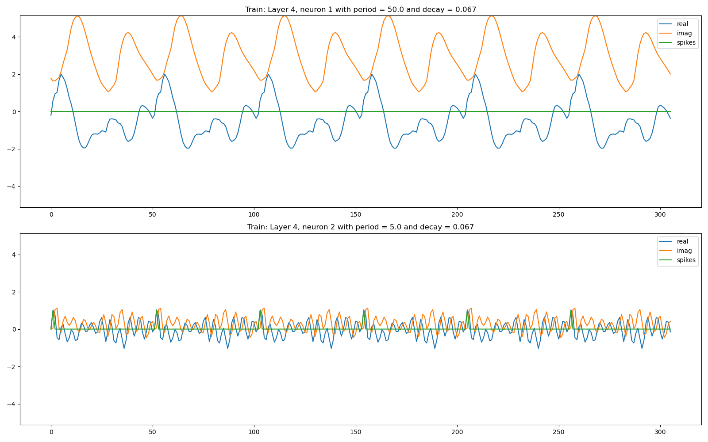
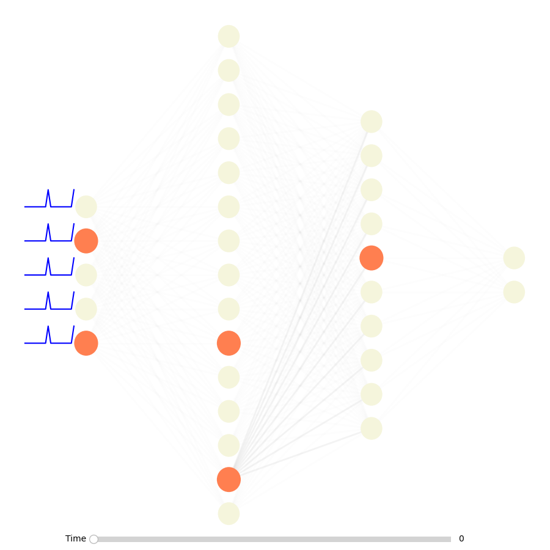
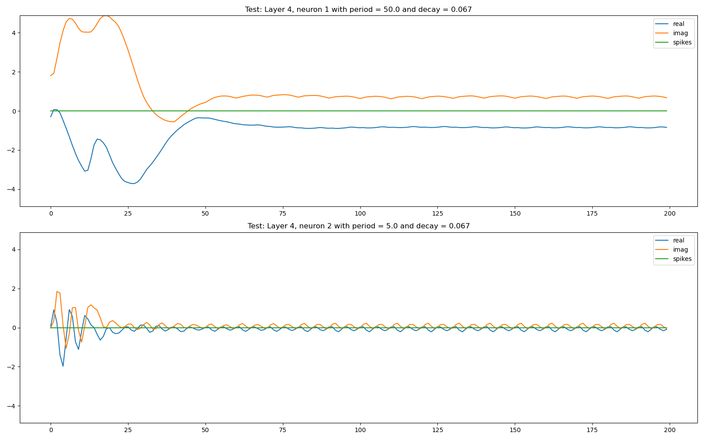

# Pattern Recognition Resonators

This project demonstrates Resonate-and-Fire (RF) neurons and unsupervised hebbian learning can be combined to build Spiking Neural Networks (SNNs) that are capable of recognizing (complex) patterns in time data.

## Setup

Clone the repository and cd into it. Dependency installation is shown using [micromamba](https://mamba.readthedocs.io/en/latest/user_guide/micromamba.html), but you can also use conda or other virtual environments. Ultimately, apart from standard libraries you only need to import the RF neuron class from [lava-dl](https://github.com/lava-nc/lava-dl/releases/tag/v0.4.0)

```bash
micromamba create -f conda-env.yml -c conda-forge
micromamba activate neuromorphic-computing
```

Download `lava-dl-0.4.0.tar.gz` to be compatible with the rest of this setup from [here](https://github.com/lava-nc/lava-dl/releases/tag/v0.4.0). Then install it with

```bash
pip install ~/Downloads/lava-dl-0.4.0.tar.gz
```

## Run

Make changes to the network architecture in [general_network.py](./general_network.py). Run the network using 

```bash
python3 general_network.py 
```

## Experimentation

The visualizer as well as the network are flexible enough to try out different network architectures. Vizualisation supports both dynamic animations through matplotlib's FuncAnimation, as well as interactive time-picking through the matplotlib slider widget.

**Hyperparameters:**

RF Neuron:
- `decay`: the decay rate of the RF neuron(s) output signal
- `threshold`: the amplitude at which the RF neuron spikes (default=1 because input spikes are non-graded, meaning also 1)
- `period`: of each RF neuron, determines the period (and thus also the frequency) an RF neuron recognizes

The lava-dl RF neuron class can represent complete neuron layers with an arbitrary number of neurons inside, where the size of the layer is determined by the size of the input spike trail. Upon instantiation, the hyperparameters can be passed as boundaries, e.g. decay = [decay_min, decay_max], such that after a first input has been processed, the individual neurons in the layer are created with linearly spaced decays between decay_min and decay_max (cp. lava-dl's documentation for more details).

Learning:
- `beta`: the rate of synaptic plasticity (~ learning rate in typical ANNs)
- `b`: the rate of memory fading, should be in [0,1]. Here, small `b` means slow memory fading, where as b=1 implies no memory at all.

## Results

We have no proper evaluation comparing against other state-of-the-art networks yet, as this code was created during a neuromorphic hackathon organized by [neurotum](https://www.neurotum.com/) x [Fortiss](https://www.fortiss.org/). 
The hyperparameters, input data and output data of the experimental networks are saved in [save](./save).

**Proof-of-Concept on SOS:**

We encoded an SOS signal and fed it into the below visualized network. 
The animation shows the second neuron on the fourth layer blinking every time the SOS signal is fully received.

For each layer we need to specify a range of frequencies the RF neuron selects. This explains why only some neurons are propagating the signal in certain layers, as only these neurons match the frequency of the input signal closely enough. Experimental results showed this to be working well for frequencies that are in the range of +-2Hz of the input spike. 

We have also visualized the two neurons in the fourth layer in a line chart, which shows when they spike:




The network recognizes this specific signal, but ignores other signals such as the one we sent in the animation below:



The line chart shows for this input the neurons on the fourth layer never spiked:




## Credits

Credits for this work go to:

- Borislav Polovnikov
- Thomas Huber
- Eric Armbruster
- Reem Al Fata
- Jules Lecomte

Thank you Reem and Jules for supervising us during this hackathon and providing us with such an amazing topic!

Thank you also to the whole neuromorphic [Fortiss](https://www.fortiss.org/) research team and to [neurotum](https://www.neurotum.com/) for providing us with this amazing opportunity to work on cutting-edge research topic, organizing, and preparing the hackathon!


